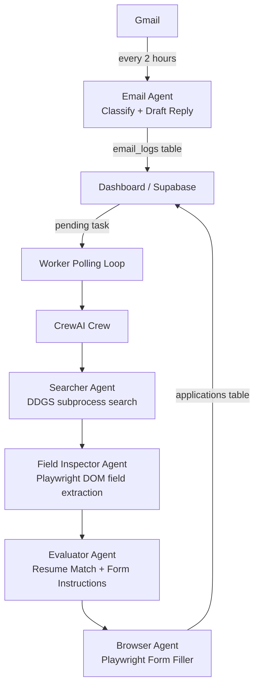

# Agentic Job Hunter

> Set your criteria. Let the agent handle the rest.

[](https://www.python.org/downloads/)
[](https://www.crewai.com/)
[](https://ollama.com/)
[](https://supabase.com/)
[](https://nextjs.org/)
[](LICENSE)
[](CONTRIBUTING.md)

---

## Overview

Agentic Job Hunter is an autonomous multi-agent system that automates the end-to-end job search and application process. You define your search criteria — job title, location, keywords, minimum salary — and the agent framework handles the rest: finding relevant listings, evaluating each one against your resume, filling out application forms headlessly via Playwright, and logging every outcome to a Supabase database.

The system is built on [CrewAI](https://www.crewai.com/) and runs entirely against local [Ollama](https://ollama.com/) models, meaning there are no external API costs and your resume and personal data never leave your machine. A lightweight Next.js dashboard gives you a real-time view of pending tasks, submitted applications, and email responses — all backed by the same Supabase instance the worker writes to.

An optional Gmail integration polls your inbox on a configurable schedule, classifies incoming recruiter emails, and drafts contextual replies using the same local LLMs. Every interaction is tracked in structured logs using `structlog`, making it easy to audit what the agent did and why.

## Demo

> **[Video walkthrough coming soon]** — Watch the agent find, evaluate, and apply to 5 jobs autonomously.


## How It Works



The worker polls Supabase for tasks with `status = "pending"`. For each task it spins up a CrewAI crew with four sequential agents:

1. **Searcher** — queries DuckDuckGo for job listings via `ddgs.DDGS` running in an isolated child process. Each query has a 15-second hard timeout (the subprocess is killed if it hangs) and calls are serialized through a threading lock with a 3-second rate-limit delay. Returns up to 5 candidate job URLs.
2. **Field Inspector** — visits each job URL with a headless Chromium browser, clicks through listing pages to the actual application form, and extracts the exact form field labels from the rendered DOM (`<label>` text, `placeholder`, `aria-label`, `name` attributes). Also detects whether a resume upload field is present. Runs Playwright inside a `ThreadPoolExecutor` to avoid conflicts with CrewAI's asyncio event loop. Results are returned as a structured `InspectedJobs` Pydantic model.
3. **Evaluator** — receives the inspected field lists, filters out listings that don't meet your salary/keyword criteria, and maps your personal data to the exact field names found on each form. Produces an `ApplicationPackets` Pydantic model with per-field fill instructions.
4. **Browser** — drives a headless Chromium browser via Playwright, navigates to each job URL, fills in form fields using the evaluator's instructions, and submits the application.

Results are written back to Supabase and surface immediately in the dashboard.

## Features

- **Fully autonomous application loop** — from search to form submission with no human in the loop
- **Local LLM inference** — runs on Ollama; no OpenAI or Anthropic API keys required
- **Resume-aware evaluation** — each listing is scored against your actual resume PDF before any form is touched
- **DOM field inspection** — a dedicated Field Inspector agent visits each listing page, clicks through to the application form, and extracts the exact field names before any fill attempt
- **Headless browser automation** — Playwright fills and submits real web forms, not just job board APIs
- **Structured application tracking** — every attempt (applied, failed, skipped) is persisted to Supabase with timestamps and error context
- **Email agent** — Gmail integration classifies recruiter messages and drafts replies on a configurable poll interval
- **Real-time dashboard** — Next.js frontend shows live application status, task queue, and email logs
- **Immutable data models** — frozen dataclasses throughout the worker prevent accidental state mutation
- **Structured logging** — `structlog` JSON output makes log aggregation and debugging straightforward
- **Pre-commit hooks and CI** — ruff, mypy, and pytest run automatically on every commit and pull request

## Tech Stack

| Backend | Frontend |
|---------|----------|
| Python 3.12 | Next.js 14 (App Router) |
| CrewAI (multi-agent orchestration) | TypeScript |
| Ollama (local LLM inference) | Tailwind CSS |
| Playwright (browser automation) | Supabase JS client |
| ddgs (DuckDuckGo search) | |
| Supabase (Postgres + Realtime) | |
| structlog (structured logging) | |
| pydantic-settings (config) | |
| uv (package management) | |

## Prerequisites

1. [Python 3.12+](https://www.python.org/downloads/)
2. [uv](https://docs.astral.sh/uv/getting-started/installation/) — fast Python package manager
3. [Ollama](https://ollama.com/download) — local LLM runtime
4. [Node.js 20+](https://nodejs.org/) — for the dashboard
5. [Supabase account](https://supabase.com/) — free tier is sufficient (or self-host)
6. [Playwright browsers](https://playwright.dev/python/docs/intro) — installed automatically via `uv sync`

## Quick Start

```bash
# 1. Clone the repository
git clone https://github.com/your-org/agent-job-finder.git
cd agent-job-finder

# 2. Install Python dependencies
uv sync

# 3. Install Playwright browsers
uv run playwright install chromium

# 4. Pull the required Ollama models
ollama pull qwen3.5:9b
ollama pull gemma4:e4b

# 5. Set up your environment
cp .env.example .env
# Edit .env with your Supabase credentials (see Configuration below)

# 6. Run the Supabase migration
# In the Supabase dashboard SQL editor, paste and run:
# supabase/migrations/0001_initial.sql

# 7. Add your personal files
# See Configuration -> personal_data.json below
cp /path/to/your/resume.pdf worker/personal/resume.pdf

# 8. Start the worker
uv run python -m worker.main

# 9. Start the dashboard (separate terminal)
cd dashboard
npm install
npm run dev
# Open http://localhost:3000
```

## Configuration

### Environment Variables

| Variable | Description | Required | Default |
|----------|-------------|----------|---------|
| `SUPABASE_URL` | Your Supabase project URL | Yes | — |
| `SUPABASE_KEY` | Supabase anon/public key | Yes | — |
| `SUPABASE_SERVICE_ROLE_KEY` | Supabase service role key (worker writes) | Yes | — |
| `FAST_MODEL` | Ollama model for lightweight tasks | No | `ollama/qwen3.5:9b` |
| `REASONING_MODEL` | Ollama model for evaluation/reasoning | No | `ollama/gemma4:e4b` |
| `OLLAMA_BASE_URL` | Ollama API base URL | No | `http://localhost:11434` |
| `RESUME_PATH` | Path to your resume PDF | No | `./worker/personal/resume.pdf` |
| `PERSONAL_DATA_PATH` | Path to personal_data.json | No | `./worker/personal/personal_data.json` |
| `EMAIL_POLL_INTERVAL_SECONDS` | How often to check Gmail | No | `7200` |
| `GMAIL_CREDENTIALS_PATH` | Path to Gmail OAuth credentials | No | `./worker/personal/credentials.json` |
| `GMAIL_TOKEN_PATH` | Path to Gmail OAuth token cache | No | `./worker/personal/token.json` |
| `LOG_LEVEL` | Logging verbosity | No | `INFO` |

### personal_data.json

The browser agent uses this file to populate form fields like name, email, phone, and LinkedIn URL. Create it at `worker/personal/personal_data.json`:

```json
{
  "first_name": "Jane",
  "last_name": "Smith",
  "email": "jane.smith@example.com",
  "phone": "+1-555-000-0000",
  "linkedin_url": "https://linkedin.com/in/janesmith",
  "github_url": "https://github.com/janesmith",
  "portfolio_url": "https://janesmith.dev",
  "location": "San Francisco, CA",
  "years_of_experience": 5,
  "preferred_work_type": "remote",
  "authorized_to_work": true,
  "requires_sponsorship": false
}
```

The `worker/personal/` directory is gitignored — your personal data never leaves your machine.

### Ollama Models

| Model | Purpose | Pull Command |
|-------|---------|-------------|
| `qwen3.5:9b` | Fast tasks: search result ranking, field mapping | `ollama pull qwen3.5:9b` |
| `gemma4:e4b` | Reasoning: resume evaluation, reply drafting | `ollama pull gemma4:e4b` |

You can substitute any model supported by Ollama by updating the `FAST_MODEL` and `REASONING_MODEL` env vars.

## Running the Worker

```bash
uv run python -m worker.main
```

On startup the worker validates your configuration, connects to Supabase, and begins polling for pending tasks. You'll see structured JSON logs like:

```
{"event": "worker_started", "poll_interval": 30, "level": "info"}
{"event": "task_picked_up", "task_id": "abc-123", "job_title": "Software Engineer", "level": "info"}
{"event": "application_submitted", "company": "Acme Corp", "status": "applied", "level": "info"}
```

Use the dashboard to create search tasks and monitor results in real time.

## Running the Dashboard

**Development:**

```bash
cd dashboard
npm install
npm run dev
# Open http://localhost:3000
```

**Production (Vercel):**

```bash
# Set NEXT_PUBLIC_SUPABASE_URL and NEXT_PUBLIC_SUPABASE_ANON_KEY in your Vercel project settings
vercel deploy
```

## Email Agent Setup (Optional)

The email agent uses Gmail OAuth to monitor your inbox for recruiter messages.

1. Create a project in [Google Cloud Console](https://console.cloud.google.com/)
2. Enable the **Gmail API**
3. Create OAuth 2.0 credentials (Desktop application type)
4. Download `credentials.json` and place it at `worker/personal/credentials.json`
5. On first run the worker will open a browser window for OAuth consent — the token is cached at `worker/personal/token.json`
6. Set `EMAIL_POLL_INTERVAL_SECONDS` to control how often Gmail is checked (default: every 2 hours)

## Database Setup

Migrations live in `supabase/migrations/`. To set up the schema:

1. Open your Supabase project dashboard
2. Go to **SQL Editor**
3. Copy and run the contents of `supabase/migrations/0001_initial.sql`

This creates the `search_tasks`, `applications`, and `email_logs` tables with appropriate indexes and Row Level Security policies.

## Project Structure

```
agent-job-finder/
├── .github/
│   └── workflows/
│       ├── ci.yml              # Lint, type check, test on PRs
│       └── security.yml        # pip-audit on PRs and weekly
├── dashboard/                  # Next.js frontend
│   ├── app/
│   ├── components/
│   └── package.json
├── supabase/
│   └── migrations/
│       └── 0001_initial.sql
├── worker/
│   ├── agents/                 # CrewAI agent definitions
│   │   ├── browser.py
│   │   ├── email_agent.py
│   │   ├── evaluator.py
│   │   ├── field_inspector.py  # DOM field extraction agent
│   │   └── searcher.py
│   ├── db/
│   │   ├── client.py           # Supabase client singleton
│   │   └── repository.py       # Data access layer
│   ├── models/                 # Frozen dataclasses
│   │   ├── application_result.py
│   │   ├── job.py
│   │   └── search_criteria.py
│   ├── personal/               # Gitignored — resume, credentials, personal data
│   ├── tests/
│   │   ├── test_config.py
│   │   ├── test_models.py
│   │   └── test_repository.py
│   ├── config.py               # pydantic-settings Settings class
│   ├── logging_config.py       # structlog setup
│   └── main.py                 # Worker entry point
├── .env.example
├── .pre-commit-config.yaml
├── pyproject.toml
├── search_criteria.csv         # Example criteria input
└── uv.lock
```

## Development

**Install pre-commit hooks:**

```bash
uv run pre-commit install
```

Hooks run ruff (lint + format), mypy, and trailing-whitespace checks on every commit. The pytest suite runs on `git push`.

**Run tests:**

```bash
uv run pytest
```

**Lint and format:**

```bash
uv run ruff check .
uv run ruff format .
```

**Type check:**

```bash
uv run mypy worker/
```

## Contributing

1. Fork the repository
2. Create a feature branch: `git checkout -b feat/your-feature`
3. Write tests first, then implement
4. Ensure `uv run pytest` passes and `uv run ruff check .` is clean
5. Open a pull request against `main` with a clear description of the change

Please follow conventional commit format (`feat:`, `fix:`, `docs:`, etc.) and keep PRs focused on a single concern.

## License

MIT — see [LICENSE](LICENSE) for details.
